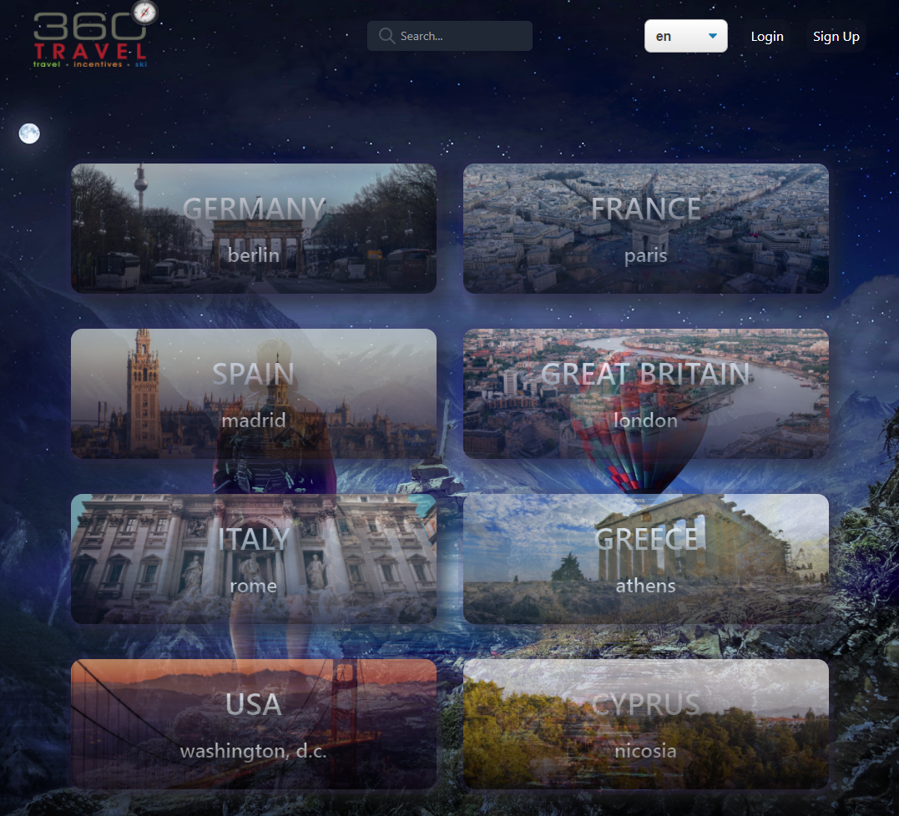
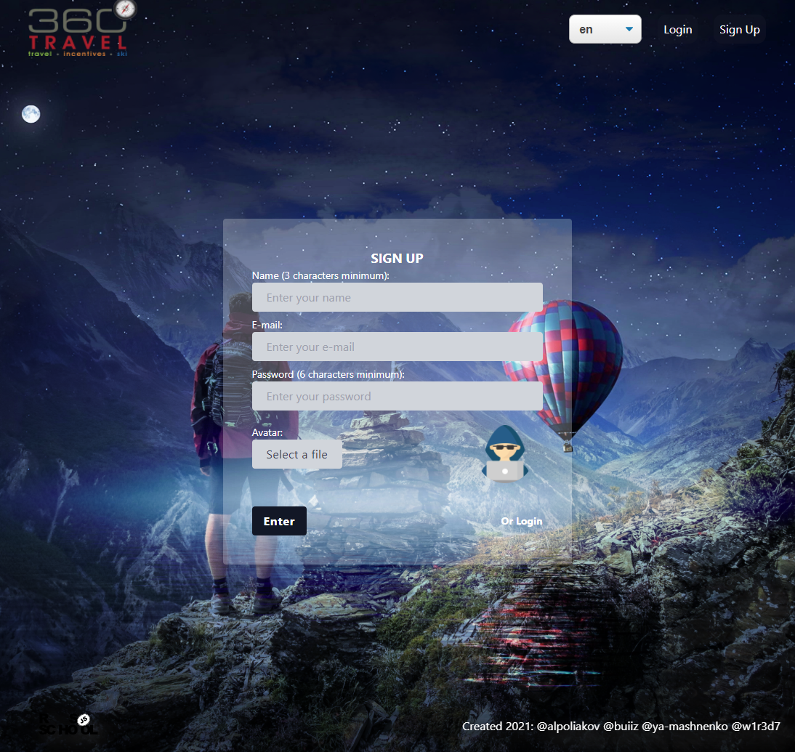
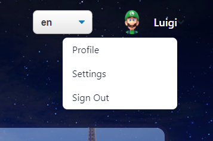
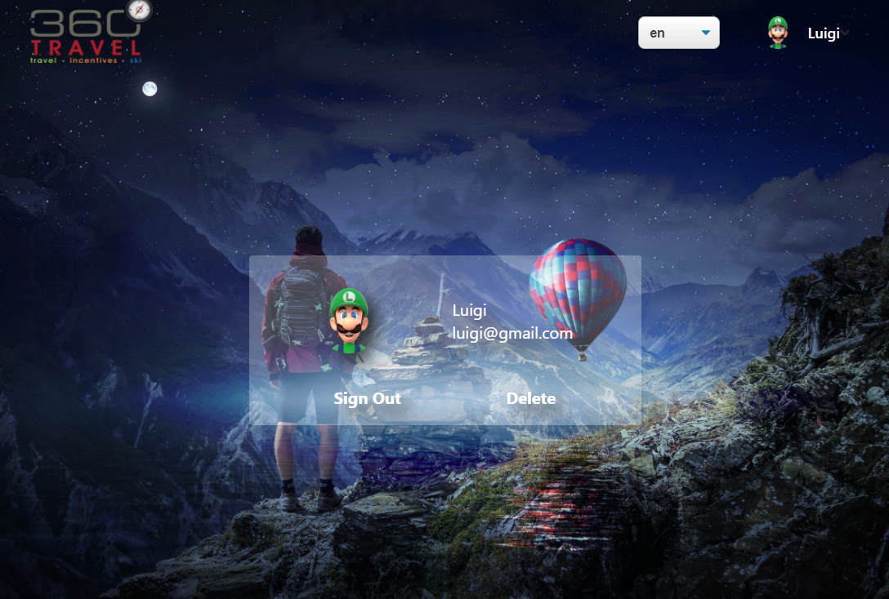
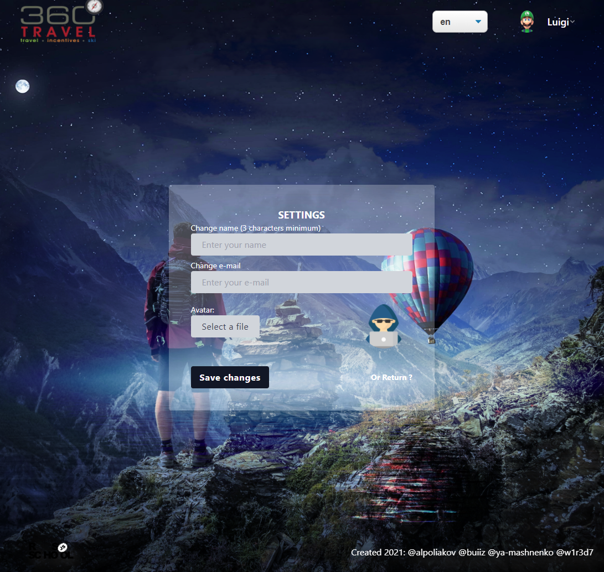
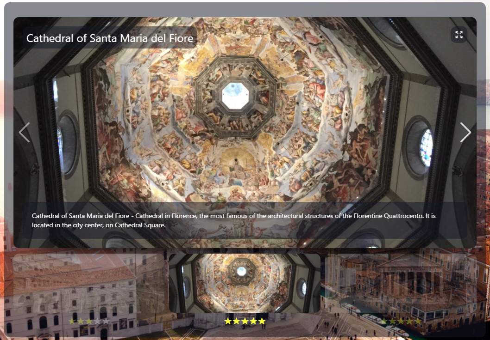
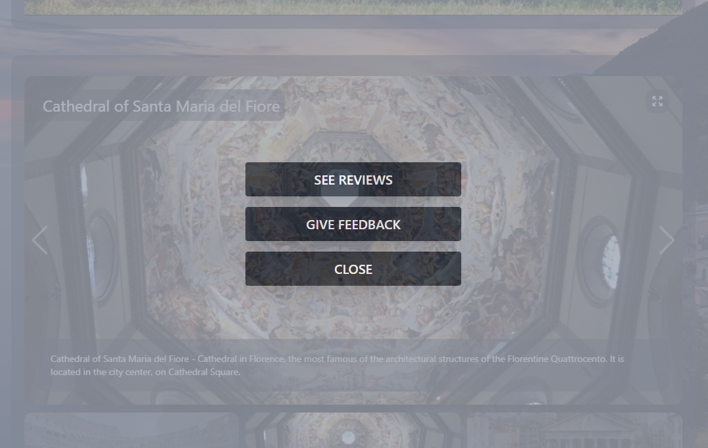
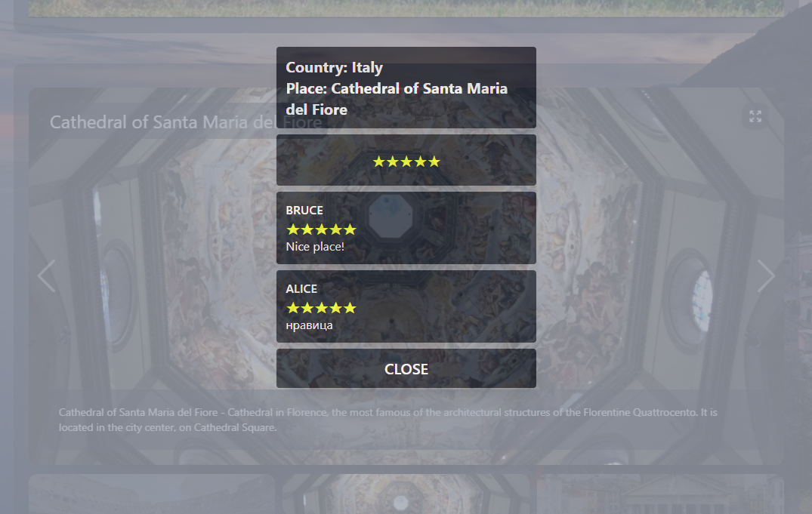
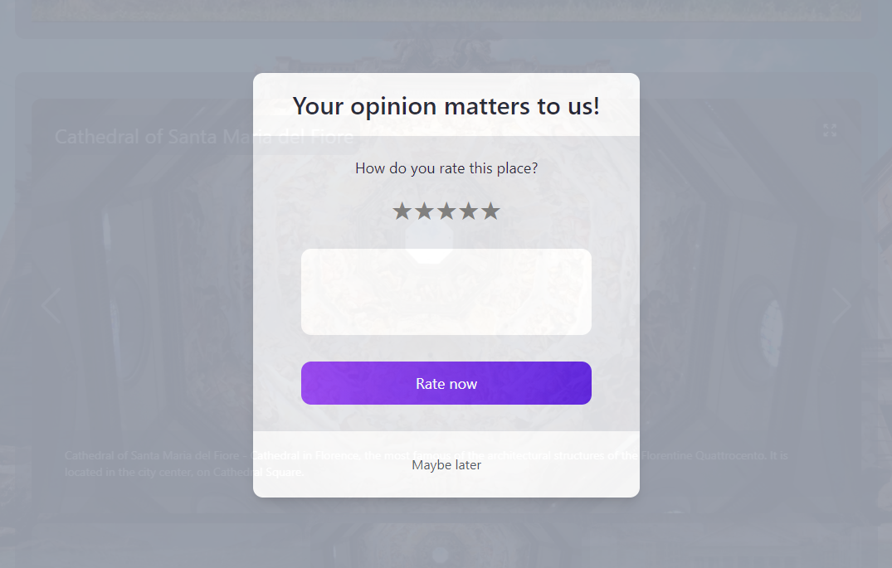

# travel-app

## Описание

Приложение для виртуальных путешествий по странам мира. В приложении доступна информация по 8 странам на 3х языках (ru, en, uk).

Приложение состоит из нескольких страниц. Таких как: главная, страница страны, настройки, профиль, а также страницы регистрации и авторизации.

_Главная страница_

Первым делом переходя на сайт, ваш курсор попадает в поле поиска, в которое вы можете ввести название страны или столицы, по мере ввода исчезают страны которые не попадают под заданный поисковый запрос. Если вы еще не определились с выбором, то можете смело кликать по любой приглянувшейся стране и начать ее изучать.

И вот вы оказались на странице выбранной страны. Здесь можно узнать время в столице, курс валют, а так же погоду.
Есть так же небольшая историческая справка о данной стране. Устали читать ? Ниже вас ждет увлекательное видео о стране.
И это еще не все, чуть ниже есть слайдер с фотографиями, описание и рейтингом достопримечательностей.
Фотографии можно перелистывать стрелками по краям, а так же открыть на полный экран.

В самом конце нас ждет изюминка - карта. На карте граница страны обведена, а столица выделена иконкой. Карту можно развернуть на полный экран и при желании менять масштаб. Если хотите прогуляться по выбранной вами стране, то можно схватить человечка в правом углу и отпустить его на интересующую вас улицу, и вам откроется панорама это места.

_Страница страны_

Также на каждой странице есть хедер и футер. В хедере есть лого (клик по которому возвращает на главную страницу), меню смены языка страницы, меню пользователя (если пользователь авторизован) или кнопки для авторизации/регистрации (если пользователь не авторизован) В футере есть логотип и список авторов проекта.

_Страница регистрации_

Чтобы посмотреть или оставить отзыв, нужно кликнуть на превью достопримечательности. Не открывается ? Конечно, нам нужны отзывы реальных людей и для этого вам нужно зарегистрироваться или войти, если вы у нас не первый раз.
Регистрация и вход происходит через шапку сайта. Для этого нужно заполнить все поля (имя, емейл, пароль) и подтвердить. Есть возможность добавить аватар/фото профиля. Аналогичным образом можно авторизоваться.

_Меню пользователя_

В профиле пользователь может выйти из аккаунта или удалить его.

_Профиль пользователя_

В настройках можно изменить имя, емейл или аватар.

_Настройки пользователя_

Теперь когда сайт нас узнает, мы можем кликнуть по миниатюре достопримечательности. После клика откроется меню с вариантами посмотреть отзывы или оставить. Оставить отзыв просто, выберите рейтинг в звездах и напишите комментарий.

_Галерея_

_Меню отзывов_

_Отзывы_

_Оставить отзыв_

## Архитектура и технологии

### Back-end

- Node.js
- Express
- GraphQL
- MongoDB

### Front-end

- React
- Next.js
- Apollo
- TypeScript
- Tailwind CSS
- Framer Motion

### Тестирование

- Jest
- testing-library
